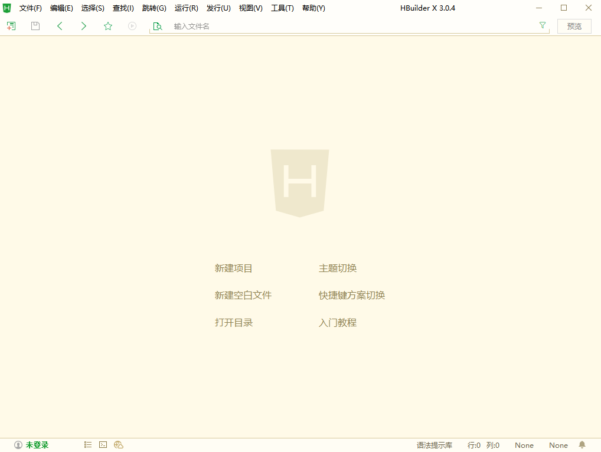

# 仓库

- `dataset`：训练和测试数据集；
- `doc`：实验报告和使用的图片；
- `exe`：PC端直接运行软件；
- `index`：前端部署；
- `index1`：前端部署的其它版本；
- `result`：四代模型对比测试图；
- `wechat`：微信小程序端部署；
- `log.md`：训练相关信息

# 数据统计

面值为：1、5...100的人民币数据：

|数据|1|5|10|20|50|100|
|:-|:-|:-|:-|:-|:-|:-|
|大小（张）|134|99|156|99|167|132|

# 四次迭代模型

## 第一次训练

- 模型选择：如果要求预测时间或模型体积尽量小时，建议使用 MobileNetV3_large_xi_0
- 参数：
```json
conf = {
    "epochs": 20,  # 预估数据训练迭代次数,实际训练迭代最大次数会受系统限制，请注意日志输出
    "batch_size": 16,  # batch_size必须限制在以下范围：P4[1, 16]; V100[1, 32]; P40[1, 32];
    # 实际训练时，显存占用会动态变化；当出现"Out of memory error on GPU"（显存不足）错误时，请适当减少batch_size
    "log_interval": 10,  # 控制训练日志输入频率
    "eval_interval": 5,  # 控制评估的间隔迭代数, 过多的评估会影响模型训练速度，过少的评估会影响最优指标模型的挑选。
    "mix_up": False,  # 控制是否使用mix_up
    "mixup_alpha": 0.2, # mix_up参数值，设置在[0,1]
    "label_smoothing": False,  # 控制是否使用label_smoothing
    "label_smoothing_epsilon": 0.1,  # label_smoothing参数值，设置在[0,1]
    "input_size": 224,  # 输入图片宽和高，大尺寸图片会导致显存溢出，建议范围[224,448]
}
```
- 增强策略：默认
- 超参数据：脚本编译，看【参数】
- 显卡：GPU-P4-4节点

## 第二次训练

- 模型选择：ResNet50模型效果稳定，并且预测时间较短
- 参数：
```json
conf = {
    "epochs": 20,  # 预估数据训练迭代次数,实际训练迭代最大次数会受系统限制，请注意日志输出
    "batch_size": 16,  # batch_size必须限制在以下范围：P4[1, 16]; V100[1, 32]; P40[1, 32];
    # 实际训练时，显存占用会动态变化；当出现"Out of memory error on GPU"（显存不足）错误时，请适当减少batch_size
    "log_interval": 10,  # 控制训练日志输入频率
    "eval_interval": 5,  # 控制评估的间隔迭代数, 过多的评估会影响模型训练速度，过少的评估会影响最优指标模型的挑选。
    "mix_up": False,  # 控制是否使用mix_up
    "mixup_alpha": 0.2, # mix_up参数值，设置在[0,1]
    "label_smoothing": False,  # 控制是否使用label_smoothing
    "label_smoothing_epsilon": 0.1,  # label_smoothing参数值，设置在[0,1]
    "input_size": 224,  # 输入图片宽和高，大尺寸图片会导致显存溢出，建议范围[224,448]
}
```
- 增强策略：默认
- 超参数据：脚本编译，看【参数】
- 显卡：GPU-P4-4节点

## 第三次训练

- 模型选择：当数据量较大并且要求更高的准确率时，建议从 ResNet101中选择模型，预测时间相比ResNet50会更长
- 参数：
```json
conf = {
    "epochs": 20,  # 预估数据训练迭代次数,实际训练迭代最大次数会受系统限制，请注意日志输出
    "batch_size": 16,  # batch_size必须限制在以下范围：P4[1, 16]; V100[1, 32]; P40[1, 32];
    # 实际训练时，显存占用会动态变化；当出现"Out of memory error on GPU"（显存不足）错误时，请适当减少batch_size
    "log_interval": 10,  # 控制训练日志输入频率
    "eval_interval": 5,  # 控制评估的间隔迭代数, 过多的评估会影响模型训练速度，过少的评估会影响最优指标模型的挑选。
    "mix_up": False,  # 控制是否使用mix_up
    "mixup_alpha": 0.2, # mix_up参数值，设置在[0,1]
    "label_smoothing": False,  # 控制是否使用label_smoothing
    "label_smoothing_epsilon": 0.1,  # label_smoothing参数值，设置在[0,1]
    "input_size": 224,  # 输入图片宽和高，大尺寸图片会导致显存溢出，建议范围[224,448]
}
```
- 增强策略：默认
- 超参数据：脚本编译，看【参数】
- 显卡：GPU-P4-4节点

## 第四次训练

- 模型选择：当数据量较大并且要求更高的准确率时，建议从 ResNet101中选择模型，预测时间相比ResNet50会更长
- 参数：
```json
conf = {
    "epochs": 20,  # 预估数据训练迭代次数,实际训练迭代最大次数会受系统限制，请注意日志输出
    "batch_size": 16,  # batch_size必须限制在以下范围：P4[1, 16]; V100[1, 32]; P40[1, 32];
    # 实际训练时，显存占用会动态变化；当出现"Out of memory error on GPU"（显存不足）错误时，请适当减少batch_size
    "log_interval": 10,  # 控制训练日志输入频率
    "eval_interval": 5,  # 控制评估的间隔迭代数, 过多的评估会影响模型训练速度，过少的评估会影响最优指标模型的挑选。
    "mix_up": False,  # 控制是否使用mix_up
    "mixup_alpha": 0.2, # mix_up参数值，设置在[0,1]
    "label_smoothing": False,  # 控制是否使用label_smoothing
    "label_smoothing_epsilon": 0.1,  # label_smoothing参数值，设置在[0,1]
    "input_size": 224,  # 输入图片宽和高，大尺寸图片会导致显存溢出，建议范围[224,448]
}
```
- 增强策略：自动
- 超参数据：脚本编译，看【参数】
- 显卡：GPU-P4-6节点

# 模型选择

选取测试数据为：test1【`正面5元（正例）`】、test2【`正面暗色100元（正例）`】、test3【`正面2角（负例）`】

|模型\测试|test1|test2|test3|
|:-|:-|:-|:-|
|MobileNetV3|99.86%|95.69%|54.56%|
|ResNet50|100%|99.95%|72.72%|
|ResNet101|99.99%|99.92%|45.57%|

|对比内容\模型|MobileNetV3|ResNet50|ResNet101|
|:-|:-|:-|:-|
|epochs|20|20|20|
|增强策略|默认|默认|默认|
|机器|GPU-P4-4节点|GPU-P4-4节点|GPU-P4-4节点|
|网络特点|模型小，预测时间短|准确率高|更高准确率|

# 模型调优

|对比内容\模型|ResNet101|ResNet101-plus|
|:-|:-|:-|
|epochs|20|20|
|增强策略|默认|自动搜索|
|机器|GPU-P4-4节点|GPU-P4-6节点|
|训练时长（min）|12|53|


|模型\测试|test1|test2|test3（错误分类数）|
|:-|:-|:-|:-|
|ResNet101|√|√|5|
|ResNet101-plus|√|√|3|

# PC端部署

获取`AK`和`SK`后直接运行：
```python
python app.py
```

> 可以使用`pyinstaller`进行再打包！

# 前端部署

自己写的页面，简陋，愿意美化的可以去美化：
```python
python upload_pictures.py
```

# 移动端部署

1. 点击下载[HBuilderX](https://www.dcloud.io/hbuilderx.html)

下载App开发版

2. 点击新建项目

3. 填写相关参数创建项目

4. 点击`mainfest.json`进行配置，点击`发行`->`原生APP-云打包`

5. 填写相关参数进行打包

6. 点击打开目录，查看打包后的apk，安装到安卓手机客户端


> 打开之后出现`NOT FOUNT` ，在端口后面加上`/upload`即可访问使用！

# 小程序端部署

基于之前的项目


